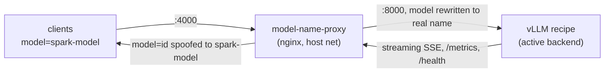

# model-name-proxy

Generic-name front for the vLLM recipes: clients always talk to
`http://spark.shawndo.intra:4000` with model **`spark-model`**, while the
actual backend recipe serves on **:8000** under its own name. Switching
backends is a one-line `.env` change — no client updates.



## Why this exists

1. **Model-name churn.** Every recipe serves a different model name
   (`deepseek-v4-flash`, `glm-5.3-flash`, ...). Pointing clients directly at
   vLLM means updating every client whenever the backend recipe changes. With
   the proxy, `spark-model` never changes.
2. **Transparent metrics.** The earlier SparkRun proxy hid URLs (spec-decode
   metrics) from benchmark runs. This proxy is a *transparent* pass-through:
   `/metrics` (including the DSpark
   `vllm:spec_decode_num_draft_tokens_total` / `..._accepted_tokens_total`
   counters), `/health`, and SSE streaming all reach the client byte-for-byte.
   Nothing is buffered except the tiny request body needed to rewrite the
   model name.

## What is rewritten (and what is not)

Request normalization is always on; response spoofing depends on
`SPOOF_RESPONSES` (see "Two modes" below).

| direction | route | transformation |
|---|---|---|
| request | `/v1/chat/completions` (and all POST bodies) | `"model":"<anything>"` → `BACKEND_MODEL` (the real served name) so vLLM never 404s — always on |
| response | `/v1/models` | real served names → `SPOOF_MODEL` — always on |
| response | `/v1/chat/completions` (incl. SSE deltas) | real served name → `SPOOF_MODEL` — mode B only; mode A leaves them untouched |
| both | everything else | **no transformation** — byte-for-byte proxy |

## Two modes: can I tell which model is active?

`SPOOF_RESPONSES` in `.env` (default `0` = mode A) controls completion-response
spoofing. `/v1/models` is ALWAYS spoofed in both modes (it must keep
advertising the stable generic name); request normalization is also always on.

| mode | `SPOOF_RESPONSES` | `/v1/models` says | chat/completions responses say | use |
|---|---|---|---|---|
| A — real name in completions | `0` | `spark-model` | real backend name (`deepseek-v4-flash`, …) | default; model list generic, completion responses reveal the active model |
| B — full spoof | `1` | `spark-model` | `spark-model` | real name must never leak anywhere |

Request normalization (client sends `spark-model` → backend hears its real
served name) is ALWAYS on in both modes — no client reconfiguration is ever
needed to switch models or modes.

Switch mode:

```bash
cd model-name-proxy
sed -i 's/^SPOOF_RESPONSES=.*/SPOOF_RESPONSES=1/' .env   # or edit by hand
docker compose --env-file .env up -d
```

One-off override without touching `.env`:

```bash
SPOOF_RESPONSES=1 docker compose --env-file .env up -d
```

In mode A, `/v1/models` is your "what's active" check:

```bash
curl -s http://spark.shawndo.intra:4000/v1/models | jq -r .data[].id
```

## Files

| file | role |
|---|---|
| `nginx.conf.template` | nginx config; `__SPOOF_RULES_*__` placeholders filled at start |
| `docker-entrypoint.sh` | renders the template from `.env` (awk + envsubst) and execs nginx |
| `lua/access.lua` | request-body rewrite: `model` → `BACKEND_MODEL` |
| `docker-compose.yml` | the service (host networking, port 4000) |
| `.env` | `SPOOF_MODEL`, `BACKEND_MODEL`, `SPOOF_FROM`, `SPOOF_RESPONSES`, `UPSTREAM` |

## Running (leader node only)

The compose uses `network_mode: host`, so the proxy binds :4000 on the leader's
host stack — exactly where clients expect it. The backend vLLM binds :8000
(recipes' `PORT=8000`).

```bash
cd ~/code/spark-recipes/model-name-proxy
docker compose --env-file .env up -d --build
```

Verify:

```bash
curl -s http://spark.shawndo.intra:4000/v1/models | jq -r .data[].id   # -> spark-model
curl -s -o /dev/null -w '%{http_code}\n' http://spark.shawndo.intra:4000/health   # 200
curl -s http://spark.shawndo.intra:4000/metrics | grep spec_decode     # raw passthrough
```

## Switching backends

1. Stop the current recipe container(s) (both nodes) and start the new recipe
   as usual (worker first, then head — see the ops skill).
2. Edit `model-name-proxy/.env`: set `BACKEND_MODEL` to the new recipe's
   `--served-model-name` (mapping table in the `.env` comments).
3. `docker compose --env-file .env up -d` (recreates the proxy with the new
   value; the spoofed client-facing name is unchanged).

## Config reference

| var | default | meaning |
|---|---|---|
| `SPOOF_MODEL` | `spark-model` | the name clients see |
| `BACKEND_MODEL` | `deepseek-v4-flash` | the ACTIVE recipe's real served name; request rewrites target it |
| `SPOOF_FROM` | all known recipe names | real names rewritten in responses |
| `SPOOF_RESPONSES` | `0` | response spoofing toggle: `0` = mode A (real names visible), `1` = mode B (everything says `spark-model`) |
| `UPSTREAM` | `127.0.0.1:8000` | vLLM backend address |

- **`BACKEND_MODEL` must match the running recipe's `--served-model-name`.**
  If they disagree, chat requests fail with vLLM's model-not-found error while
  `/v1/models` still works (mode B spoofs its response; mode A shows the
  real name).
- **Add new served names to `SPOOF_FROM`** when a new recipe lands, or the
  real name will leak through in `/v1/models` and completion responses.
- **Request bodies must be JSON with a flat `"model"` key** for the Lua
  rewrite to hit. Requests without a `model` field pass through unchanged
  (vLLM then uses its default served name).
- `sub_filter` operates on uncompressed bodies; the config strips
  `Accept-Encoding` upstream. That is intentional (vLLM does not gzip SSE by
  default) — do not re-enable compression without reworking the rewrite.
